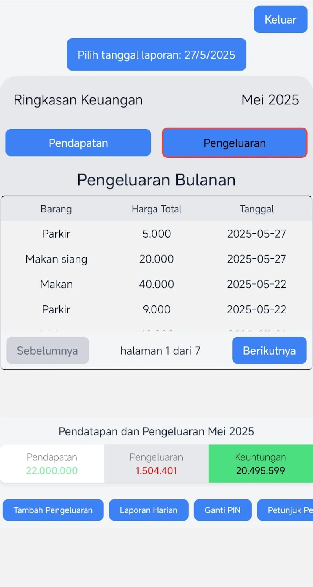
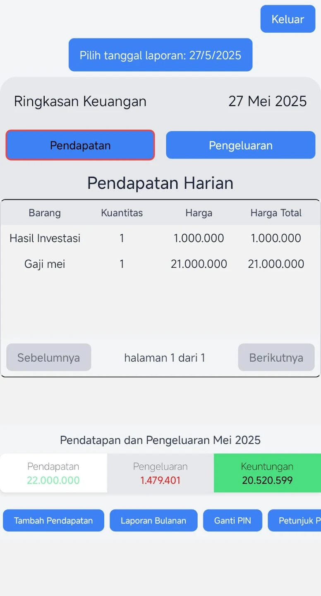
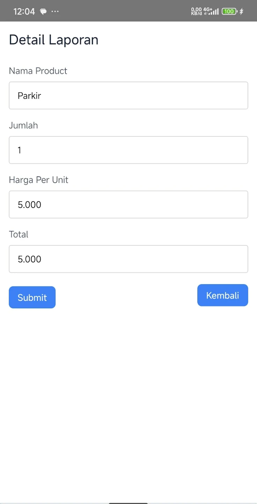
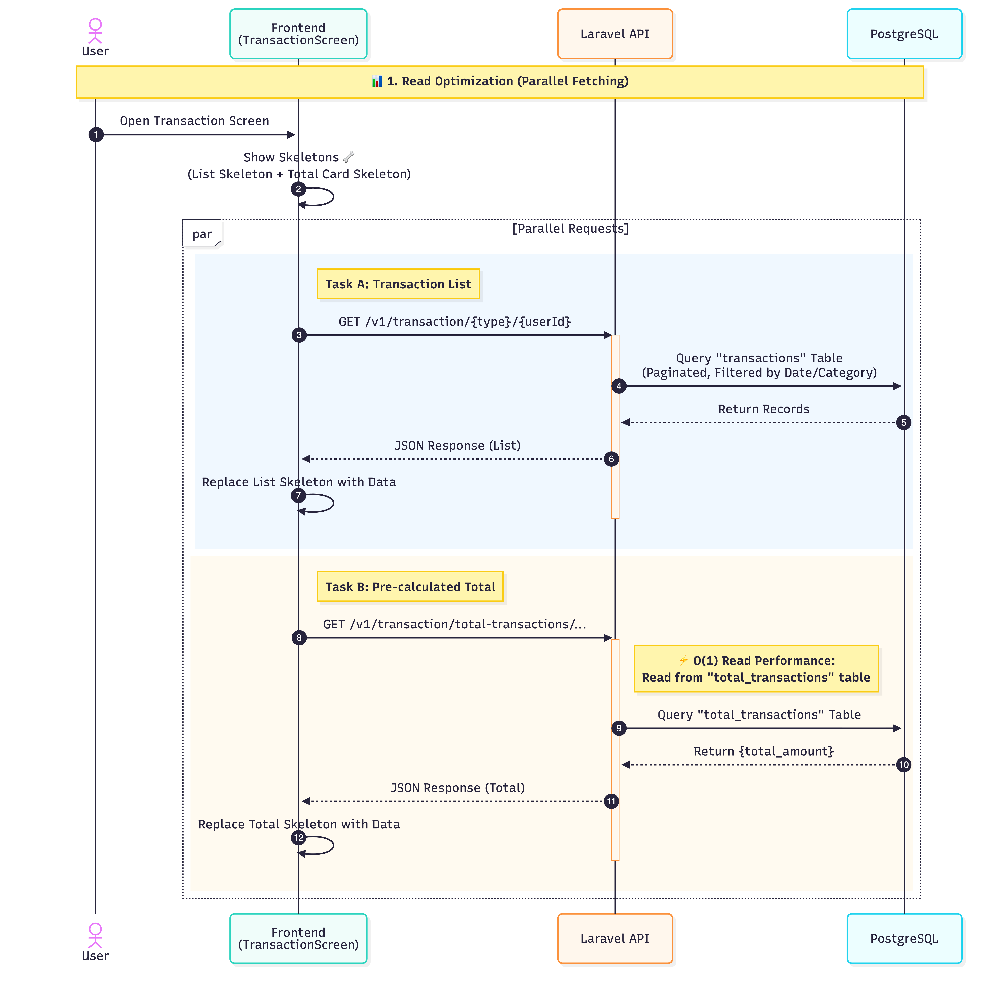

# Cataku - Finance Tracker 💰

💰

> **A production-ready personal finance tracker built with an Offline-First approach.**

---

## 📱 Project Philosophy: Radical Simplicity

**Cataku** was built with a singular goal: **Zero-Friction Financial Tracking.**

While many modern apps suffer from feature bloat and complex UIs, this project strictly adheres to **Minimalist Design Principles**. The interface is intentionally stripped down to ensure usability across all demographics—from tech-savvy Gen Z to elderly users who need large, clear touch targets without distractions.

**Why this matters:**

- **Cognitive Load Reduction:** Users can log transactions in < 3 seconds.
- **Universal Accessibility:** High contrast and simple navigation make it usable for non-digital natives.
- **Performance:** The lightweight UI logic (powered by NativeWind) ensures instant rendering even on low-end devices.

**[GOOGLE PLAYSTORE](https://play.google.com/store/apps/details?id=com.barqidev.app&hl=id)**

---

## 🚀 Key Features

### 1. Dynamic Category Management (New Implementation)

To provide granular financial insights, I implemented a flexible categorization system allowing users to define their own financial taxonomy.

- **CRUD Operations:** Users can Create, Rename, and Delete custom categories (e.g., "Salary", "Groceries", "Entertainment").
- **Relational Mapping:** Transactions are loosely coupled with categories, allowing for nullable assignment.
- **Aggregated Insights:** The system generates summaries based on these user-defined categories to visualize spending habits.

### 2. Core Functionalities

- **Expense & Income Tracking:** Rapid data entry optimized for minimal user friction.
- **Offline Capability:** Fully functional without an internet connection using a local embedded database.
- **Data Privacy:** All financial data resides on the user's device.

---

## 📷 App Showcase

|               Dashboard Expense               |               Dashboard Income                |               Transaction Form                |
| :-------------------------------------------: | :-------------------------------------------: | :-------------------------------------------: |
|  |  |  |

_(Screenshots displaying the 'Radical Simplicity' design philosophy)_

---

## 🛠 Technical Stack & Architecture

This project was built to demonstrate **scalable mobile architecture** and **robust data handling**.

### 📱 Mobile Client (Android)

The mobile client is built on the bleeding edge of the React Native ecosystem.

- **Core Framework:** `React Native 0.76` (Leveraging the performance improvements).
- **Language:** `TypeScript` (Strict typing for maintainability).
- **State Management:** `Recoil` (Atomic state management for granular re-renders and high performance).
- **Styling:** `NativeWind` + `TailwindCSS` (Utility-first styling for consistent design systems).
- **Navigation:** `React Navigation 7` ( Routing).
- **Storage:** `@react-native-async-storage` (Persisting user preferences).
- **Animations:** `react-native-reanimated` (60fps declarative animations).
- **Quality Assurance:** `Jest` + `@testing-library/react-native` (Unit & Integration testing).

### 🔙 Backend API (The Core)

- **Language:** PHP 8.2
- **Framework:** Laravel 12
- **Authentication:** Laravel Sanctum (Secure Token-Based Auth)
- **Quality Assurance:** PHP CS Fixer & PHPUnit
- **SEO/Indexing:** Spatie Laravel Sitemap
- **Database:** Postgresql with Relational Schema with Eloquent ORM

---

## 💡 Key Engineering Decisions

### 1. Infrastructure-Driven Refactoring (Node.js ➡️ Laravel)

Initially, the backend was developed using **Node.js**. However, during the deployment phase, I encountered compatibility constraints with the target hosting infrastructure (Shared environment) which was not optimized for long-running Node processes.

**The Solution:**
Instead of forcing an incompatible stack, I made the strategic decision to **migrate and rewrite the backend using Laravel (PHP 8.2)**.

- **Infrastructure Alignment:** PHP is natively supported by the hosting environment, ensuring higher stability and zero downtime without complex process management.
- **Development Velocity:** Leveraging Laravel's ecosystem (Sanctum, Eloquent) allowed me to rapidly port the business logic while maintaining strict type safety.
- **Future-Proofing:** The move to Laravel 12 ensures the system runs on the latest, most secure framework version available.

### 2. Adopting React Native 0.76 (New Architecture)

I deliberately upgraded the codebase to **React Native 0.76** to align with the latest industry standards.

- **Fabric & TurboModules:** Preparing the app for the New Architecture to benefit from direct C++ bindings.
- **Performance:** Eliminating the legacy bridge bottleneck to ensure smoother UI interactions on mid-range devices.

### 3. Pragmatic State Management (Recoil)

Instead of adopting a heavy boilerplate solution like Redux, I chose **Recoil** for atomic state management.

- **Reasoning:** For an application of this scope, Redux introduces unnecessary complexity.
- **Benefit:** Recoil offers a minimal, atomic API that allows for rapid development. This aligns with the principle of **"Right-Sizing the Architecture"**—avoiding over-engineering where a simpler solution suffices.

### 4. Performance: Pre-Computed Aggregation (CQRS Pattern)

Calculating total monthly expenses (`SUM(amount)`) on-the-fly becomes exponentially slower as transaction history grows.

- **The Strategy:** I implemented a **"Write-Heavy, Read-Light"** approach using a separate `total_transactions` table.
- **The Benefit:** Fetching the dashboard balance is always **O(1)**, ensuring the app feels incredibly snappy regardless of data volume.

### 5. UI Strategy: Radical Simplicity

I consciously prioritized **Accessibility over Aesthetics**.

- **The Goal:** Zero-friction usage for users across all age groups.
- **The Execution:** Leveraged **NativeWind** to build a high-contrast, linear interface that minimizes cognitive load and maximizes render performance.

---

## 🔐 Security & Auth Architecture

### 1. Login Flow with Rate Limiting (Freeze Logic)

To prevent brute-force attacks on the 6-digit PIN, I implemented a **Server-Side Freeze Mechanism**.

- **Logic:** If a user fails authentication multiple times, the account is logically "frozen" in the database for **6 minutes**.
- **Security:** All 500 errors are masked as generic messages to the client, while real stack traces are logged internally.

### 2. PIN Lifecycle (ACID Transactions)

All sensitive write operations (Registration, Update PIN) are wrapped in **Database Transactions** to ensure data integrity. If any part fails, the system performs a `ROLLBACK` to prevent orphan records.

---

## 📊 Transaction Data Flow & Optimization

### 1. Read Flow: Parallel Fetching

To optimize the user experience, the Dashboard performs **Parallel Requests** to fetch the Transaction List and the Pre-calculated Total simultaneously, while displaying individual Skeleton Loaders.

### 2. Create Flow: Atomic Aggregation

When a transaction is created, the system updates both the `transactions` table and the `total_transactions` table within a single ACID transaction. The app then optimistically navigates back to the Homepage and refreshes the data in the background.

### 3. Mutation Strategy (Update & Soft Deletes)

- **Soft Deletes:** Transactions are never physically removed. The system sets a `deleted_at` timestamp for audit trails.
- **Consistency:** The aggregation table is immediately synchronized (amount subtracted) upon deletion logic.

---

_Developed by **Barqi Fuady** - Senior Software Engineer_
